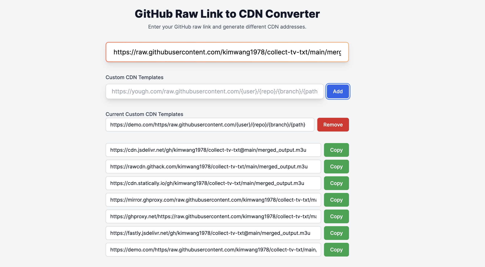

# GitHub Raw Link to CDN Converter

This project provides a web application to convert GitHub raw file links to various CDN formats. The app supports predefined CDN templates and allows users to add custom CDN templates.

## Features

- Convert GitHub raw file links to multiple CDN formats
- Add and manage custom CDN templates
- Copy generated CDN links to clipboard
- Tooltips for better user experience

## Predefined CDN Templates

- `https://cdn.jsdelivr.net/gh/{user}/{repo}@{branch}/{path}`
- `https://rawcdn.githack.com/{user}/{repo}/{commit}/{path}`
- `https://cdn.statically.io/gh/{user}/{repo}/{branch}/{path}`
- `https://mirror.ghproxy.com/raw.githubusercontent.com/{user}/{repo}/{branch}/{path}`
- `https://ghproxy.net/https://raw.githubusercontent.com/{user}/{repo}/{branch}/{path}`
- `https://fastly.jsdelivr.net/gh/{user}/{repo}@{branch}/{path}`

## Getting Started

## Deploy to Vercel

You can easily deploy this application to Vercel by clicking the button below:

[](https://vercel.com/import/project?template=https://github.com/cikichen/github-cdn-converter)


### Prerequisites

- Node.js
- npm or yarn

### Installation

1. Clone the repository:

    ```bash
    git clone https://github.com/cikichen/github-cdn-converter.git
    cd github-cdn-converter
    ```

2. Install dependencies:

    ```bash
    npm install
    # or
    yarn install
    ```

### Running the App

Start the development server:

```bash
npm run dev
# or
yarn dev
```

Open your browser and go to `http://localhost:3000` to see the app in action.

## Usage

1. Enter your GitHub raw link in the input field.
2. The app will automatically generate the corresponding CDN links.
3. Add custom CDN templates if needed.
4. Copy the generated CDN links by clicking on them.

## Adding Custom CDN Templates

1. Enter the custom CDN template in the provided input field. Use placeholders `{user}`, `{repo}`, `{branch}`, `{commit}`, and `{path}`.
2. Click the "Add" button to save the custom template.
3. The custom template will be used along with the predefined templates to generate CDN links.

## Screenshots



## Contributing

Contributions are welcome! Please open an issue or submit a pull request if you have any improvements or new features to add.

## License

This project is licensed under the MIT License. See the [LICENSE](LICENSE) file for details.

## Acknowledgments

- [Tailwind CSS](https://tailwindcss.com/)
- [React](https://reactjs.org/)
